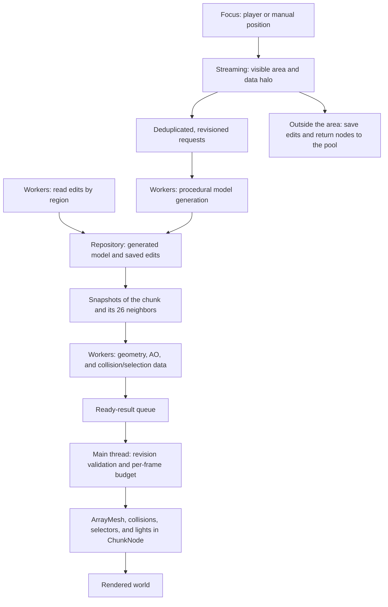

# voxelgames


A voxel game in development, built with **Godot 4.7 and a C++ GDExtension**. The engine generates, loads, and updates the world in chunks; GDScript handles the character, menus, settings, and UI coordination. The current focus is exploration and building in a procedural single-player world.

The project already includes editable terrain, biomes, caves, vegetation, water, dynamic lighting, saves, and persistent inventories. The pipeline uses workers to generate data and geometry, installs results on the main thread, and controls how much work is finalized per frame.

## Implemented features

### Procedural world

- Worlds created with a name and seed, with selection, loading, and deletion through the menu.
- **32 × 64 × 32 voxel chunks**, loaded and unloaded as the focus moves.
- Streaming within a cylindrical area, with independent horizontal and vertical ranges.
- Configurable biomes: mountains, plains, desert, ocean, river, beach, snow, frozen ocean, frozen river, and snowy shore.
- Terrain and material transitions between biomes, dunes, riverbeds, coastlines, and frozen surfaces.
- Configurable regional rarity per biome and deterministic distribution based on the seed.
- Surface, soil, rock, deepslate, configurable strata, and bedrock layers.
- Caves with rounded tunnels, curves, branches, and chambers.
- Underground iron, coal, and diamond deposits, plus dirt pockets.
- Oak trees, beach palm trees, and pine trees in snowy regions.
- Cacti, flowers, daisies, cornflowers, poppies, tall grass, short grass, and ferns.

The current registry contains **32 block types besides air**, including natural materials, logs, leaves, wood, planks, snow, ice, and torches. Existing IDs remain stable to preserve block identification in saves.

### Rendering and lighting

- Hidden-face removal and greedy meshing to merge compatible faces.
- Per-vertex ambient occlusion, accounting for neighboring chunks and diagonals across chunk boundaries.
- Separate opaque and transparent surfaces; plants use crossed quads with alpha cutout.
- Per-face textures in a `Texture2DArray`, with tint and metadata defined by the block registry.
- Water with an animated shader, refraction, and lighting-cycle response.
- Underwater visual effect when entering water.
- A default 20-minute day/night cycle: 13 minutes of daylight and 7 minutes of night, with the sky, ambient light, moon, and fog following the time of day.
- Emission on the colored inclusions in iron and diamond ore, with subtle glow.
- Torches with warm point lights, shadows, and distance fading for light and shadows.
- Chunk node reuse and preservation of torch lights when their positions remain unchanged during a rebuild.

### Character and interaction

- First-person movement, gravity, jumping, flight, and noclip mode.
- Raycast-based block breaking and placement, with an eight-block reach.
- Torch and plant selection on a dedicated collision layer, without blocking character movement.
- Collection of these objects into the hotbar or inventory; if both are full, the object remains in the world.
- Footstep sounds based on the ground material and a splash when entering water.
- Hotbar selection through number keys, the mouse wheel, and clicks when the mouse is unlocked.
- Crosshair, FPS counter, pause menu, and an initial-loading progress screen.

Placement uses the block selected in the hotbar; it currently does not automatically consume the stack quantity. Solid blocks retain their direct breaking interaction, while plants and torches use the collection flow described above.

### Inventory and HUD

- A **9-slot hotbar**, a **27-slot player inventory**, and a separate creative catalog.
- A stack limit of 99 in the game; the core supports configurable limits per item type.
- F1 switches between character control and mouse interaction with the GUI.
- Independent buttons to open the player inventory and creative catalog.
- Movable, resizable windows with persistent position and size.
- Windows can remain open during exploration; F1 returns control to the character.
- Grids adjust their columns to the window width in real time, with a minimum of two columns and fixed logical capacity.
- Drag-and-drop transfers, stack swaps, and partial merges that preserve the remainder at the source.
- Cancellation through F1, closing the source window, or an invalid or full destination, followed by an item presentation refresh.
- Icons, quantities, names, categories, tooltips, and drag previews.
- CPU-generated, cached block icons, invalidated when textures or registry data change.
- Inventories with fixed UUIDs, independent of grid lifetimes and restored from disk.

**The previous crafting system has been removed.** Ingredients left in crafting slots in older saves are preserved in a recovery record and returned to the inventory when space becomes available. New worlds do not create a crafting inventory.

### Menus and settings

- Main menu displayed over a real voxel scene with a slowly orbiting camera.
- Temporary background scene with a low render distance, without a player or the need to load or create a saved world.
- World creation and selection, pause, return to the menu, and settings accessible from either the main menu or pause menu.
- Horizontal range of **4–30 chunks** and vertical range of **2–6 chunks**, with sliders using integer steps.
- Distance fog and fog-start adjustment in 5% steps.
- VSync, resolution, and windowed/fullscreen modes.
- Antialiasing options: off, FXAA, and MSAA 2×/4×; native resolution and FSR 1/2 options depending on the renderer.
- SSAO option and separate Master, Music, and SFX volume controls.
- Persistent audio, display, graphics, and window-layout settings.

## Controls

| Input | Action |
|---|---|
| W / A / S / D | Move the character |
| Mouse | Rotate the camera while character control is active |
| Space | Jump |
| Double-tap Space | Switch between walking and flight |
| E / Q | Ascend / descend in flight or noclip |
| F or Tab | Toggle noclip |
| Left mouse button | Break a block or collect a selectable object |
| Right mouse button | Place the selected block |
| 1–9 or mouse wheel | Select a hotbar slot |
| F1 | Unlock the mouse for the GUI / return control to the character |
| Esc | Close open inventory windows; otherwise, toggle pause |
| F2 | Toggle VSync |
| F5 | Save the world |

With the mouse unlocked, click the chest button to open the inventory or the creative button to open the catalog. Drag the title bars to move windows and use their edges to resize them.

## Engine pipeline overview

`VoxelAPI` coordinates streaming, generation, saved-edit loading, mesh construction, installation, and unloading. It can follow a focus node, such as the player, or a manual position, as used by the main menu.



### 1. Planning and streaming

The engine recalculates the active area when the focus moves to another chunk or the distance settings change. Beyond the visible area, it requests a **halo of neighboring models**, including diagonals, to build faces and AO at boundaries. Not every loaded model corresponds to a rendered chunk.

Requests are deduplicated by position. Each update receives a revision, allowing stale results to be rejected after edits or focus changes. Pending requests outside the area are canceled; tasks that have already started finish, and their results are handled according to their validity.

### 2. World data generation

The chunk model is built through ordered passes, shared as immutable configuration between workers:

| Order | Pass | Responsibility |
|---:|---|---|
| 1 | `BiomeSelectionPass` | Sample climate, terrain, biome, materials, and water per column |
| 2 | `TerrainSurfacePass` | Fill surface, soil, strata, rock, and bedrock |
| 3 | `CaveCarvingPass` | Carve tunnels, branches, and chambers |
| 4 | `OreGenerationPass` | Apply mineral deposits and underground pockets |
| 5 | `WaterFillPass` | Fill eligible columns up to the water level |
| 6 | `TreeGenerationPass` | Generate deterministic trees according to the biome |
| 7 | `VegetationGenerationPass` | Distribute plants and flowers without replacing trees |

`TerrainSampler` provides the same sampling logic for generation, queries, and initial spawn calculation. A bounded XZ column cache reuses data across Y levels. Registries are loaded before jobs run; workers do not open JSON files or load textures to generate blocks or meshes.

Saved regions are read asynchronously. Player edits are applied to procedural models before the corresponding meshes are constructed.

### 3. Geometry construction

The mesher receives snapshots of the chunk and its 26 neighbors through a combined repository query. It removes hidden faces, merges compatible faces, calculates AO, and produces geometry arrays, collision faces, and selectable-object/torch positions. Air-only chunks skip mesh construction.

Snapshots retained by jobs are protected through copy-on-write: an edit copies the model only when external readers exist. Rebuilds are requested when data arrives, the focus changes, or an edit occurs, including affected neighbors, rather than rebuilding an idle world every frame.

### 4. Publication and installation

Workers publish results into `std::deque` queues using short mutex-protected sections. The main thread validates revisions and installs results: it creates/uploads `ArrayMesh` resources and configures collisions, selectors, materials, and lights. These scene-integration operations run outside the workers.

Finalization has a default budget of **2 ms per frame** and a cap of **32 results per frame**. Time is checked between installations; an individual chunk can exceed the budget. Initial loading waits for the central region around the spawn, while the rest of the area continues arriving through streaming.

### 5. Concurrency control and tuning

The model and mesh generators use the same scheduler implementation, with separate state per stage. Defaults are a **batch size of 1 chunk** and a **limit of 8 chunks running or waiting for consumption per stage**. Tasks are finite and use Godot's `WorkerThreadPool`.

After adding the world to the scene tree, the pipeline can be configured through code:

```gdscript
world.set_pipeline_settings({
    "batch_size": 1,          # 1–8 chunks per task
    "max_inflight": 8,        # 1–16 chunks per stage
    "finalize_budget_ms": 2.0 # 0.1–8 ms
})
var stats: Dictionary = world.get_pipeline_stats()
```

Statistics expose queues, tasks, stale results, generation/wait times, synchronization, and finalization. Larger batches reduce submissions but can reduce parallelism under the same chunk limit. In the recorded benchmark, batch size 1 drained the area fastest, while batch size 2 made the central region available sooner; the size therefore remains configurable.

When switching or closing a world, the engine waits for jobs, clears the previous state, and reuses nodes through the pool. Details and measurements are available in [Pipeline optimization](docs/chunk_pipeline_optimization.md).

## Inventory architecture

```text
GridInventory reports drag start and the destination under the mouse
    → InventoryDragController in GDScript resolves grids and UUIDs
    → InventoryService in C++ validates and commits the transfer
    → inventory_changed notifies the controller
    → grids receive updated ItemView representations
```

- **`InventoryService` (C++):** logical registry of inventories, slots, limits, revisions, and atomic operations on the main thread. It receives IDs and values and has no knowledge of nodes, the player, worlds, files, or visual metadata.
- **`InventorySession` (GDScript):** defines game inventories, generates UUIDs, creates ItemViews, and handles persistence and save migration.
- **`InventoryDragController` (GDScript):** maps grids to UUIDs, validates GUI state, coordinates requests, and updates all connected views.
- **`GridInventory` / `ItemView` (C++):** visual presentation and item snapshots. Changing the presentation does not change authoritative data.
- **`InventoryManager` (GDScript):** mouse control and hotbar selection.

During a drag, the item remains in the core and save snapshots; only its representation is hidden. A rejected transfer cancels the gesture and refreshes ItemView fields from current data. Closing or destroying a grid preserves its registration and contents.

See [Inventory model](docs/inventory_service.md) and [Window interaction](docs/inventory_interaction.md).

## Persistence

Player files are stored in Godot's `user://` directory:

```text
user://voxelcraft/worlds/<id>/
├── level.json               # world, player, time, and inventory records
└── regions/
    └── region_<x>_<y>_<z>.json # chunk edits grouped by region
```

Base terrain is regenerated from the seed and receives saved edits; there is no need to save every procedural voxel. Player position and orientation, time of day, and inventory UUIDs/contents are restored when loading a world. The final save waits for earlier asynchronous writes to prevent them from overwriting the latest state.

`VoxelAPI` emits `world_opened` and `world_saving`, allowing the inventory adapter to load and save even without a player or grids. The menu preview uses a temporary world without persistence.

Settings and the icon cache are also stored in `user://`, separately from world saves. Changes to generation algorithms or registries can alter the base terrain of an existing world; saved edits continue to be reapplied to it.

## Build and run

The project is configured for Godot 4.7 and has been used with **Godot 4.7.2**. Requirements are Godot with GDExtension support, Python/SCons, a C++ compiler compatible with `godot-cpp`, and the initialized submodule.

From the repository root:

```sh
# Initialize repository dependencies
git submodule update --init --recursive

# Build the extension and copy it to project/bin/<platform>/
scons -j6 target=template_debug

# Import/open the project in the editor
godot --editor --path project

# Run the game
godot --path project
```

To build the release variant:

```sh
scons -j6 target=template_release
```

The initial scene is [main_menu.tscn](project/scenes/main_menu.tscn). [example.gdextension](project/bin/example.gdextension) defines the library paths. The extension uses `reloadable = false`; restart the Godot process after recompiling C++ to load the new library.

To generate the compilation database for an editor/IDE:

```sh
scons compiledb=yes
```

## Editing blocks, textures, and biomes

The **Block Registry** plugin, enabled in the editor, edits [block_registry.json](project/data/block_registry.json). Each block has a stable ID, name, category, per-face textures, flags, and tint. **Save and Generate** updates the runtime registry, C++ header, and texture array.

Assets can also be regenerated from the command line, followed by recompilation:

```sh
godot --headless --path project --script res://scripts/tools/rebuild_block_assets.gd
scons -j6 target=template_debug
```

Biomes, noise, terrain, layers, trees, vegetation, and rarity are defined in [biome_registry.json](project/data/biome_registry.json). The registry is validated and shared as an immutable snapshot; restart the world/game after changing its configuration. `VoxelAPI.validate_biome_registry()` allows data validation without generating a world.

References: [Block Registry](project/addons/block_registry/README.md), [Biome registry](docs/biome_registry.md), and [Icon cache](docs/block_icon_cache.md).

## Tests and benchmarks

The single entry point discovers and runs Python checks, standalone C++ tests, and Godot integration tests with live terminal logs, isolated saves/settings, timeouts, and a JSON report:

```sh
python3 tests/run_tests.py
```

Build the extension first with `scons -j6 target=template_debug`. The runner imports the project and compiles the standalone native tests automatically. It discovers new `*_test.py`, `*_test.cpp`, and `*_test.gd` files without maintaining a manual list.

```sh
python3 tests/run_tests.py --list
python3 tests/run_tests.py --filter rarity
python3 tests/run_tests.py --include-benchmarks --require-all
```

AO mesh inspection requires an active renderer; without a display, that test is explicitly skipped. `--require-all` treats skips as failures. Biome/block tests resolve identities and tuning from the registries rather than fixed IDs, array positions, or exact population counts. Controlled fixtures still define boundary and invalid-input scenarios. See [Testing guide](docs/testing.md) for options, prerequisites, output, and how to add tests.

Other useful entry points:

| Test | Coverage |
|---|---|
| `chunk_pipeline_test.gd` | Queues, limits, revisions, halo, rebuilds, and world switching |
| `chunk_pipeline_benchmark.gd` | Batch comparison and loading/drain times |
| `biome_registry_test.gd` | Configuration validation, sampler, and generation |
| `torch_test.gd` | Lights, selection, plant/torch collection, and persistence |
| `inventory_service_test.gd` | Logical core, limits, and item conservation during transfers |
| `inventory_controller_test.gd` | Dragging, rejection, ItemView refresh, and multiple views |
| `inventory_ui_test.gd` / `inventory_mouse_test.gd` | GUI events, F1, and interaction |
| `inventory_reflow_test.gd` | Variable columns without changing slots or losing items |
| `inventory_session_test.gd` | Migration, recovery of old crafting items, and world isolation |
| `inventory_disk_test.gd` | Writing and reading in separate processes; second run with `-- --read` |
| `main_menu_preview_test.gd` | Temporary world and transitions between preview and saved worlds |
| `day_night_test.gd` / `world_time_graphics_test.gd` | Cycle, saved time, and graphics options |

Headless tests verify data and behavior; appearance, FPS, and GPU assessments require a run with rendering enabled. Existing benchmark results and their conditions are recorded in [chunk_batch_benchmark.json](docs/chunk_batch_benchmark.json).

## Repository layout

| Directory | Contents |
|---|---|
| `src/` | C++ engine, GDExtension, generation, streaming, meshing, saves, and inventory core |
| `project/scripts/` | Character, menus, settings, presentation, and inventory coordination |
| `project/scenes/` | Game scenes, menu, world selection/creation, and HUD |
| `project/data/` | Block and biome registries |
| `project/generated/` | C++ IDs and metadata generated from blocks |
| `project/shaders/` / `project/textures/` | Rendering, water, underwater effects, and visual assets |
| `project/addons/block_registry/` | Block editing and asset generation tools |
| `project/tests/` / `tests/` | Integration tests, standalone algorithms, and benchmarks |
| `docs/` | Architecture, implementation, and measurement notes |
| `godot-cpp/` | Godot bindings used by the extension, as a submodule |

Additional documentation: [World generation](docs/world_generation.md), [Object selection](docs/object_selection.md), [Day/night and visual details](docs/world_polish.md), and [Caves and deposits](docs/underground_polish.md). Some historical notes record earlier values; consult the code and project registries for current parameters.
